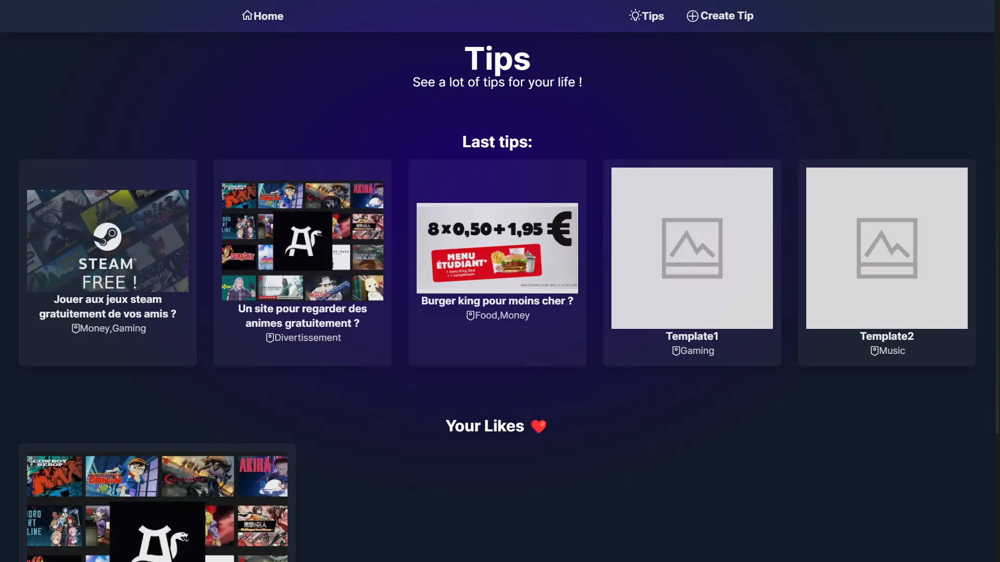

# Tips:

### Website where you can find some tips and tricks.

### Notes en français:

J'ai fait ce site dans l'unique but de tester plusieurs façons de faire et de chercher à essayer différents styles graphiques, comme ici avec ce que l'on appelle du glassmorphisme. Cependant, je pense en avoir un peu abusé, car cela peut être intéressant (par exemple, le header), mais le fait de le mettre partout rend la chose un peu lourde pour l'œil et moche. Ensuite, j'ai essayé de ne pas créer de base de données et donc d'utiliser un fichier JSON à la place. De cette manière, personne ne peut envoyer de données sur le site. De plus, je voulais réaliser quelque chose avec la fonction "create tip", de sorte qu'avec le stockage local (localstorage), cela soit en accord avec l'architecture de mon fichier JSON et que le formulaire puisse être envoyé de je ne sais quelle manière, par exemple par e-mail. Enfin, étant donné que ce projet n'est pas ambitieux, je ne vois pas l'utilité de continuer à le faire évoluer. Je préfère plutôt passer à autre chose de plus intéressant et important à mes yeux. Merci d'avoir lu jusqu'ici et bonne journée à vous.